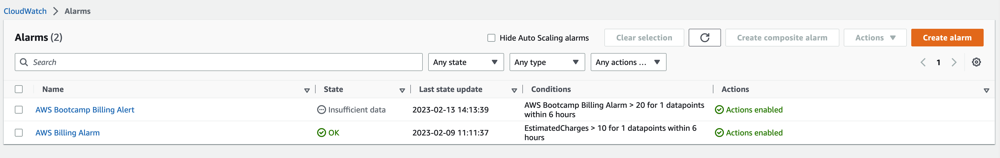
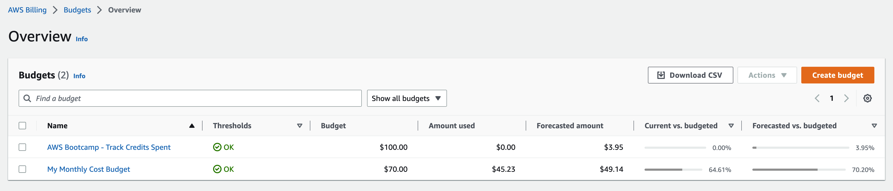
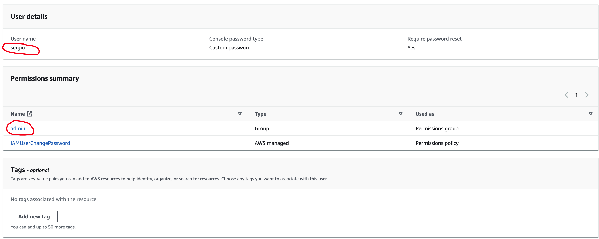
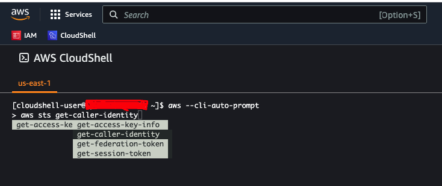
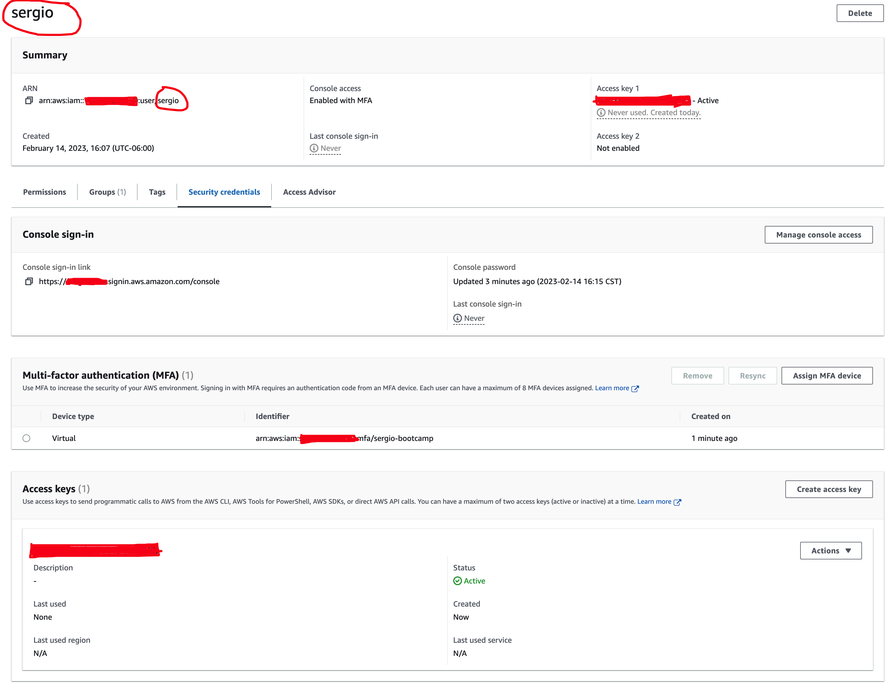
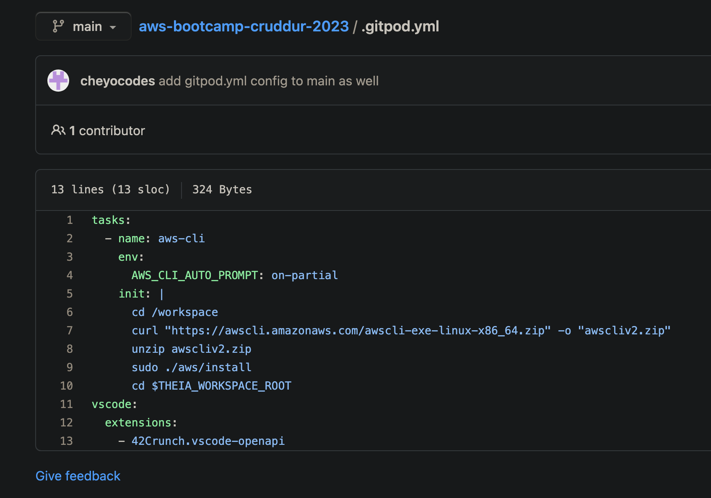
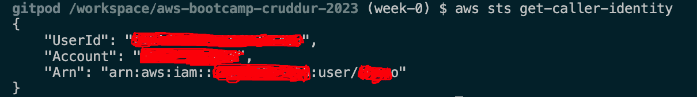

# Week 0 — Billing and Architecture

## Required Homework

### Create Billing Alarm
Created Billing alerts for the bootcamp

### Create Budget 
Created Budget to track credits spent

### Recreate Conceptual Diagram in Lucid Charts or on a Napkin	

### Recreate Logical Architectual Diagram in Lucid Charts	

## Create Admin User 
Created admin IAM user

## Use CloudShell 

## Generate AWS Credentials 
Generated AWS Credentials for programmatic and console access, and enabled MFA.

### Install AWS CLI on Gitpod.io
I successfully installed the AWS CLI on a Gitpod workspace using the `.gitpod.yml` configuration. 

here I'm sending a request to fetch account info of the current user:

### Required

