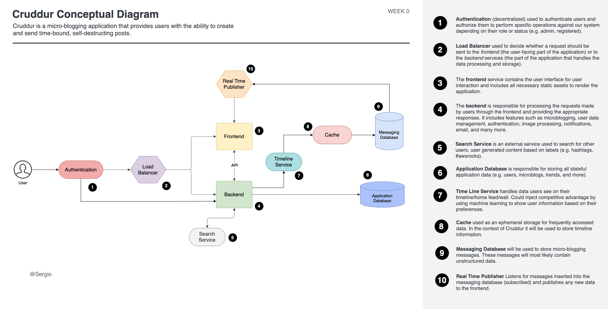
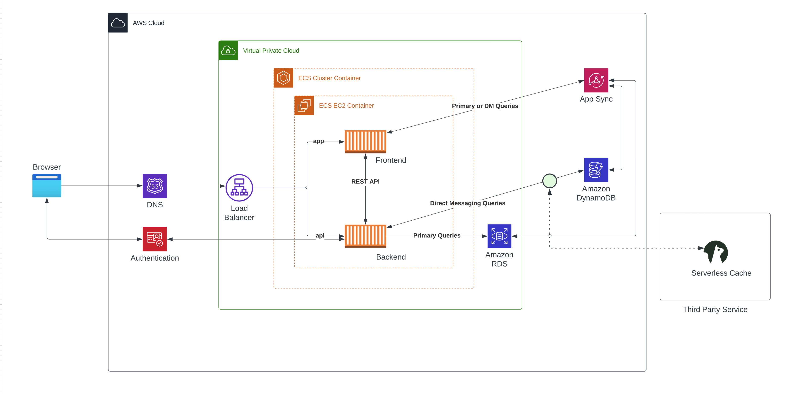

# Week 0 — Billing and Architecture

## Required Homework

### Recreate Conceptual Diagram in Lucid Charts or on a Napkin	

### Recreate Logical Architectual Diagram in Lucid Charts	

### Installed AWS CLI	

### Create a Billing Alarm	

### Create a Budget

### Required