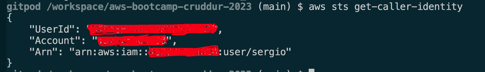

# Week 0 — Billing and Architecture

## Required Homework

### Install AWS CLI on Gitpod.io
I successfully installed the AWS CLI on a Gitpod workspace using the `.gitpod.yml` configuration. 

here I'm sending a request to fetch account info of the current user:

### Recreate Conceptual Diagram in Lucid Charts or on a Napkin	

### Recreate Logical Architectual Diagram in Lucid Charts	

### Create a Billing Alarm	

### Create a Budget

### Required

