# Week 1 — App Containerization

## Todo Checklist 
- [X] [Watched Grading Homework Summaries](https://www.youtube.com/watch?v=FKAScachFgk&list=PLBfufR7vyJJ7k25byhRXJldB5AiwgNnWv&index=25)
- [X] [Watched Week 1 - Live Streamed Video](https://www.youtube.com/watch?v=zJnNe5Nv4tE&list=PLBfufR7vyJJ7k25byhRXJldB5AiwgNnWv&index=22)
- [X] [Remember to Commit Your Code](https://www.youtube.com/watch?v=b-idMgFFcpg&list=PLBfufR7vyJJ7k25byhRXJldB5AiwgNnWv&index=23)
- [X] [Watched Chirag's Week 1 - Spending Considerations](https://www.youtube.com/watch?v=OAMHu1NiYoI&list=PLBfufR7vyJJ7k25byhRXJldB5AiwgNnWv&index=24)
- [ ] [Watched Ashish's Week 1 - Container Security Considerations](https://www.youtube.com/watch?v=OjZz4D0B-cA&list=PLBfufR7vyJJ7k25byhRXJldB5AiwgNnWv&index=25)
- [X] [Containerize Application (Dockerfiles, Docker Compose)](https://www.youtube.com/watch?v=zJnNe5Nv4tE&list=PLBfufR7vyJJ7k25byhRXJldB5AiwgNnWv&index=22)
    - [X] Containerized `backend-flask` application
    - [X] Containerized `frontend-react-js` application
    - [X] Created `docker-compose.yml` file
- [X] [Document the Notification Endpoint for the OpenAPI Document](https://www.youtube.com/watch?v=k-_o0cCpksk&list=PLBfufR7vyJJ7k25byhRXJldB5AiwgNnWv&index=27)
- [X] [Write a Flask Backend Endpoint for Notifications](https://www.youtube.com/watch?v=k-_o0cCpksk&list=PLBfufR7vyJJ7k25byhRXJldB5AiwgNnWv&index=27)
- [X] [Write a React Page for Notifications](https://www.youtube.com/watch?v=k-_o0cCpksk&list=PLBfufR7vyJJ7k25byhRXJldB5AiwgNnWv&index=27)
- [ ] [Run DynamoDB Local Container and ensure it works](https://www.youtube.com/watch?v=CbQNMaa6zTg&list=PLBfufR7vyJJ7k25byhRXJldB5AiwgNnWv&index=28)
- [ ] [Run Postgres Container and ensure it works](https://www.youtube.com/watch?v=CbQNMaa6zTg&list=PLBfufR7vyJJ7k25byhRXJldB5AiwgNnWv&index=28)


## Required Homework 
### Containerize `backend-flask`
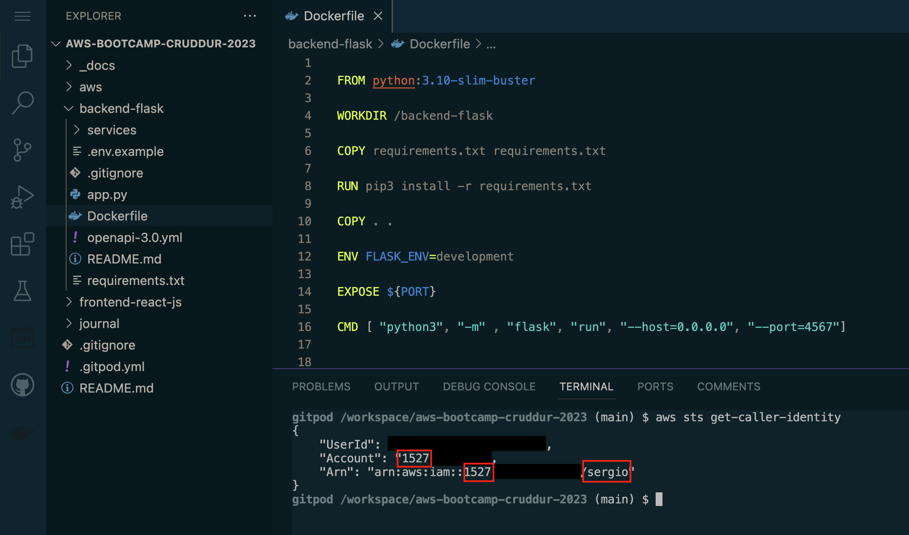

### Install flask dependencies and Run run server on Gitpod
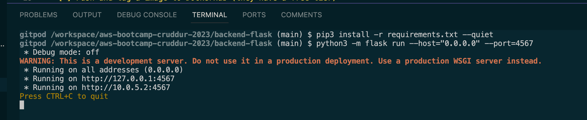

Install dependencies
```sh
pip3 install -r requirements.txt --quiet
```
This command is used to install Python packages specified in a file called requirements.txt using the pip3 package manager. The --quiet flag is used to suppress the output of the installation process.


```sh
python3 -m flask run --host="0.0.0.0" --port=4567
```
Here's a breakdown of the command and what each option does:
-   `python3`: This is the command to run the Python 3 interpreter.
-   `-m flask`: This option tells the Python interpreter to run the Flask module as a script.
-   `run`: This is the command to start the Flask development server.
-   `--host="0.0.0.0"`: This option tells the Flask development server to listen on all network interfaces, allowing the server to be accessible from outside the container.
-   `--port=4567`: This option specifies the port number that the Flask development server should listen on.

#### Unlock URL by clicking on the Lock icon
We must do this in Gitpod to gain access to the server from the URL provided. 
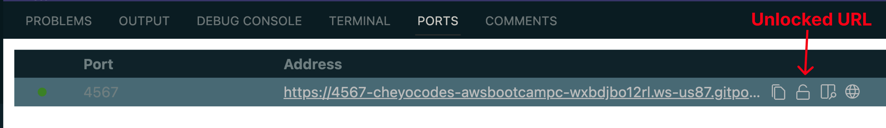


#### Not Found and Internal Server Errors 
We got a **Not Found (404) Error** because the root route (`/`) does not exist in the server. Therefore, the server is unable to find the requested resource. 
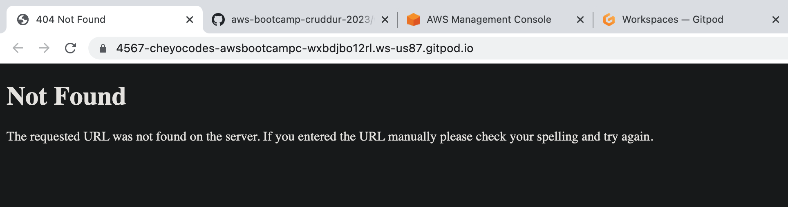

In this case we got an **Internal Server (500) Error** because we needed to set environment variables that allow the server to function properly. 
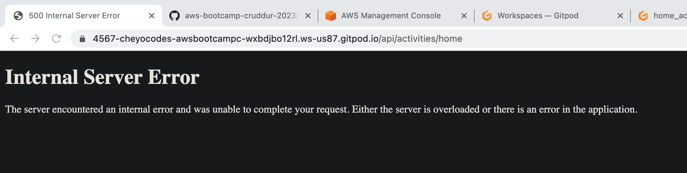


To fix these issues 👆, we needed to set two environment variables used to enable Cross-Origin Resource Sharing (CORS) requests for the flask application:

```sh 
export BACKEND_URL="*"
export FRONTEND_URL="*"
```

We also needed to append `/api/activities/home` to the backend url. 
Here's the result after successfully setting the environment variables: 


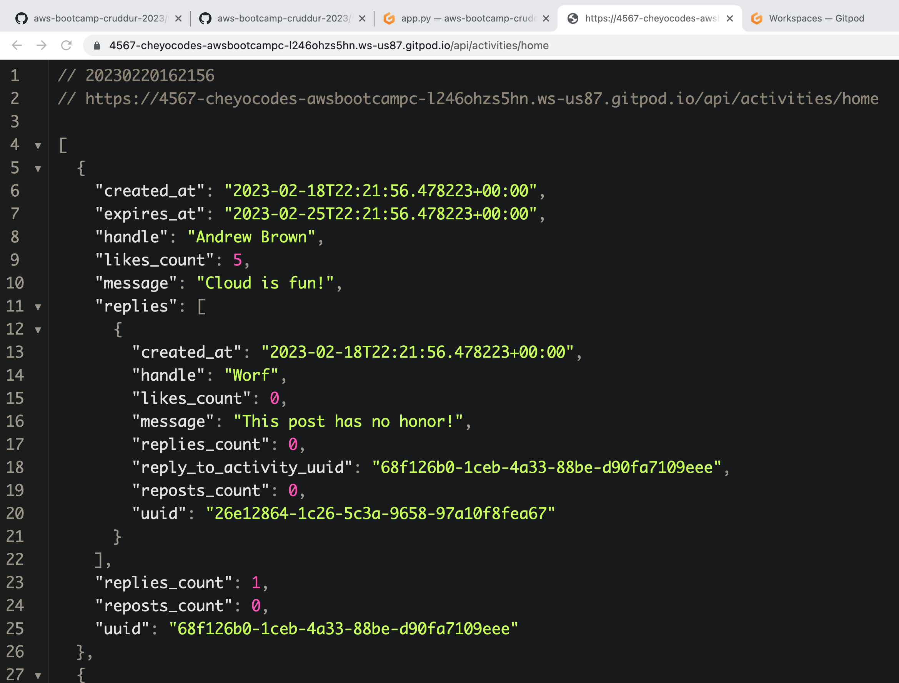


### Building the flask backend image 
```sh
# run this from the root folder
docker build -t flask-backend ./flask-backend
```

- `docker build` is the command used to build a Docker image. It takes a `Dockerfile` and a build context as input, and produces a new Docker image as output.
- `-t flask-backend` is a flag that specifies the name and optionally a tag to be assigned to the resulting Docker image. In this case, the name of the image is flask-backend.
- `./flask-backend` is the path to the build context, which is the set of files and directories that will be used as input for building the Docker image. In this case, it specifies the directory where the Dockerfile for the Flask backend is located.

So, when you run the command `docker build -t flask-backend ./flask-backend`, Docker will look for the `Dockerfile` in the `./flask-backend` directory and use it to create a new Docker image with the name `flask-backend`. The resulting image will contain all the dependencies and configurations required to run the Flask backend.

It's important to know that there are other flags and options that can be used with the docker build command to customize the build process, such as `--no-cache` to disable caching during the build, `-f` to specify a different `Dockerfile` name or location, and `-q` to suppress the build output.

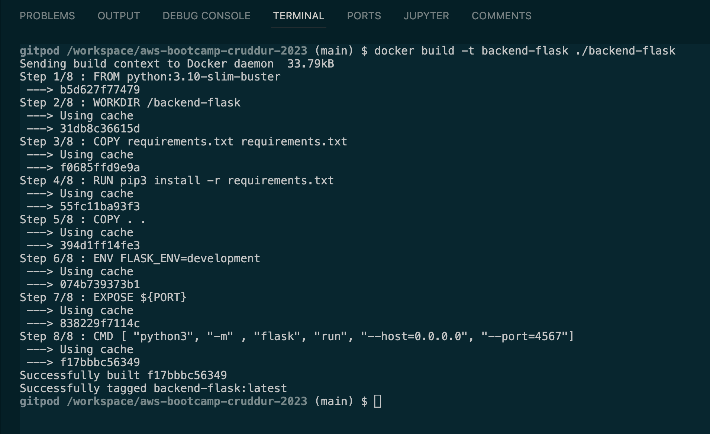


Running `docker build` results in a new image being created. We can list all the images currently stored in our computer using the following command: 
```sh
docker images
```

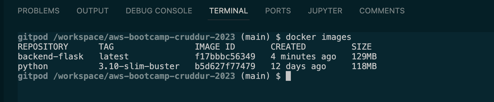

We can run the `flask-backend` image using the `docker run` command.

**Short form**:
```sh
docker container run --rm -p 4567:4567 -d backend-flask
```

**Extended form**:
```sh
docker container run --rm \
  --publish 4567:4567 \
  --detach \
  backend-flask
```

-   `docker container run`: This is the command to run a Docker container.
-   `--rm`: This option removes the container automatically when it stops running, which helps keep the Docker environment clean.
-   `--publish 4567:4567`: This option maps the host port 4567 to the container port 4567. This means that any traffic sent to port 4567 on the host machine will be forwarded to port 4567 in the container. This is useful for exposing network services running inside the container to the host machine or to the outside world.
-   `--detach`: This option runs the container in the background (detached mode), which means the container runs in the background and frees up the terminal for further use.
-   `backend-flask`: This is the name of the image to be used for creating the container.

Overall, this command creates a new Docker container based on the `backend-flask` image, exposes port 4567 to the host machine, and runs the container in the background. When the container stops running, it is automatically removed. This command is useful for running a Flask backend application in a Docker container.

Here's the output of running the command: 

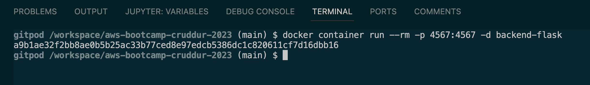


#### Listing containers
```sh
docker container ps
```

The `docker container ps` command is used to list the currently running Docker containers on your system. The `ps` stands for **"process status"**, and it provides a list of all the active containers along with their relevant details such as the container ID, image used to create the container, container status, name of the container, and the ports exposed by the container.

By default, docker container ps lists only the running containers. However, you can use various options with this command to customize the output. For example, you can use the `-a` or `--all` option to list all the containers, including the ones that have exited. You can also use the `--filter` option to filter the list of containers based on specific criteria such as container name, ID, or status.

In summary, the docker container ps command is useful for monitoring the status of Docker containers and for troubleshooting issues related to containerization.

Here's the output of running the command: 
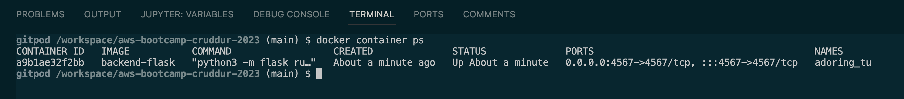


#### Setting up environment variables 
```
docker container run --rm \
  --publish 4567:4567 \
  --detach \
  backend-flask
```

#### Troubleshooting
To check if the environment variables are set, we can view the logs generated by the container: 

```sh 
docker container logs <CONTAINER_ID>
```

Alternatively, we can view the logs using the VSCode user interface: 

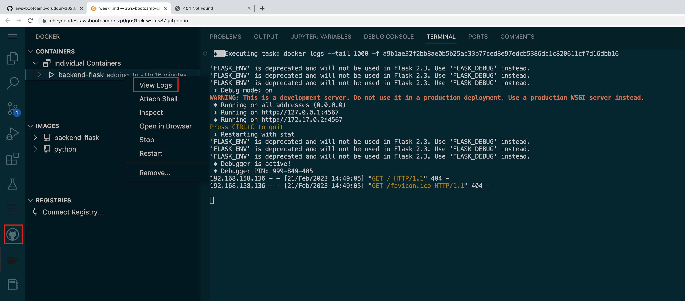


A more strightforward way to seeing if environment variables are set is by connecting into the container and looking manually for the environment variables. We can do this using the following command: 

```sh
docker container exec -it <CONTAINER_ID> bash
```
This command runs a new shell process inside an already running Docker container specified by its ID. It allows you to interact with the container's shell environment interactively.

Here is a breakdown of each part of the command:

- `docker exec` - This is the command to run a new command inside a running container.
- `-it` - This option is used to allocate an interactive terminal for the container process. This allows you to interact with the container's shell and run commands as if you were inside the container.
- `<CONTAINER_ID>` - This is the ID of the container you want to access. You can obtain the container ID by running the docker container ls or docker container ps command.

The bash command at the end of the line is the command that will be executed inside the container. In this case, it launches a new Bash shell process, which allows you to interact with the container's shell environment. You can replace bash with any other command you want to execute in the container.

Overall, this command is useful for accessing and interacting with a running container's shell environment. You can use it for tasks such as debugging, troubleshooting, or running custom commands inside the container.

You can also attach a shell to the running container by using the VSCode interface: 
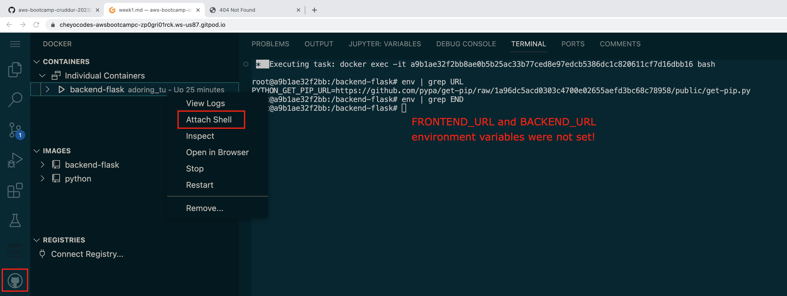


#### Setting Environment Variables with Docker Command
We can get the environment variable values set in our environment through the CLI: 
```sh
export FRONTEND_URL="*"
export BACKEND_URL="*"
```

```sh 
docker container run --rm -p 4567:4567 -it -e FRONTEND_URL -e BACKEND_URL= backend-flask
```

We can also access the values directly from our CLI without having to export them in our current shell session: 
```sh
docker container run --rm -p 4567:4567 -it -e FRONTEND_URL='*' -e BACKEND_URL='*' backend-flask
```

> **ATTENTION**: We use single quotes `''` instead of `""` because the shell might interpret the asterisk with double quotes (`"*"`) as a directory list of all the files. 

##### Questions: 
- Do we actually need to run `-it` since we don't need to pass anything through STDIN? 

#### Dockerizing the Frontend 

```sh
FROM node:16.18

ENV PORT=3000

COPY . /frontend-react-js
WORKDIR /frontend-react-js
RUN npm install
EXPOSE ${PORT}
CMD ["npm", "start"]
```

#### Running Multiple containers with Docker Compose 
```sh
version: "3.8"
services:
  backend-flask:
    environment:
      FRONTEND_URL: "https://3000-${GITPOD_WORKSPACE_ID}.${GITPOD_WORKSPACE_CLUSTER_HOST}"
      BACKEND_URL: "https://4567-${GITPOD_WORKSPACE_ID}.${GITPOD_WORKSPACE_CLUSTER_HOST}"
    build: ./backend-flask
    ports:
      - "4567:4567"
    volumes:
      - ./backend-flask:/backend-flask
  frontend-react-js:
    environment:
      REACT_APP_BACKEND_URL: "https://4567-${GITPOD_WORKSPACE_ID}.${GITPOD_WORKSPACE_CLUSTER_HOST}"
    build: ./frontend-react-js
    ports:
      - "3000:3000"
    volumes:
      - ./frontend-react-js:/frontend-react-js

# the name flag is a hack to change the default prepend folder
# name when outputting the image names
networks: 
  internal-network:
    driver: bridge
    name: cruddur
```

We can run the `docker-compose.yml` file using the `docker compose` command: 
```sh 
docker compose up
```

Alternatively, we can run the the file using the VSCode interface: 

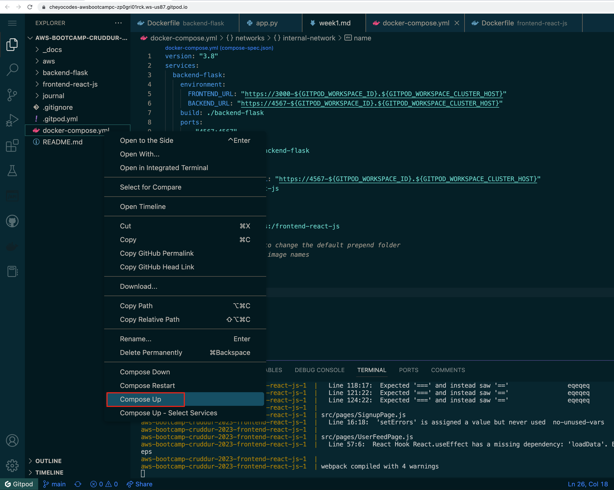


Running both the frontend and backend: 
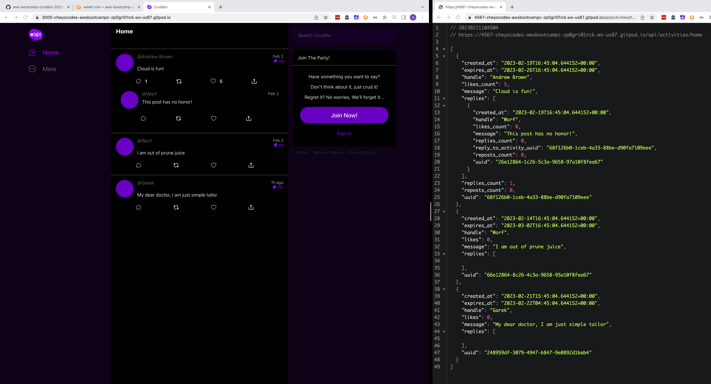


### Notification Feature 

#### Add anonymous volume to `docker-compose.yml` file
```
...
volumes:
  - ./frontend-react-js:/frontend-react-js
  - /frontend-react-js/node_modules
```
**Why do we do this?**
- By adding the - `/frontend-react-js/node_modules` line, we are telling Docker to create a second volume (an anonymous volume) in addition to the one we already have, `./frontend-react-js:/frontend-react-js`.
- When the containers are run, the Docker engine will use this secondary volume (`/frontend-react-js/node-modules`) to access the dependencies needed by the React application.
- This means that we no longer need to access the resources on our local computer. We only need the resources in the Docker container.
- As a result, we can remove the need for Node or any other local dependencies entirely.

To summarize, by adding the - `/frontend-react-js/node_modules` line, we create a second volume that allows the Docker engine to access the necessary dependencies for the React application. This eliminates the need for local resources and dependencies, such as Node, and makes the application more portable and efficient.

#### Rebuilding the containers 
Now to completely rebuild the containers, we can use the `--build` flag:
```sh
docker compose up --build 
```

### Open API Notifications 
Add activities notifications path to Cruddur's OpenAPI document

```yml
paths:
...
  /api/activities/notifications:
    get:
      description: 'Return a feed of activities for all of those people that I follow'
      tags:
        - activities
      parameters: []
      responses:
        '200':
          description: Returns an array of activities
          content: 
            application/json:
              schema: 
                type: array 
                items: 
                  $ref: '#/components/schemas/Activity'
```

#### Add `/api/activities/notifications` flask api endpoint and `NotificationsActivities` service object


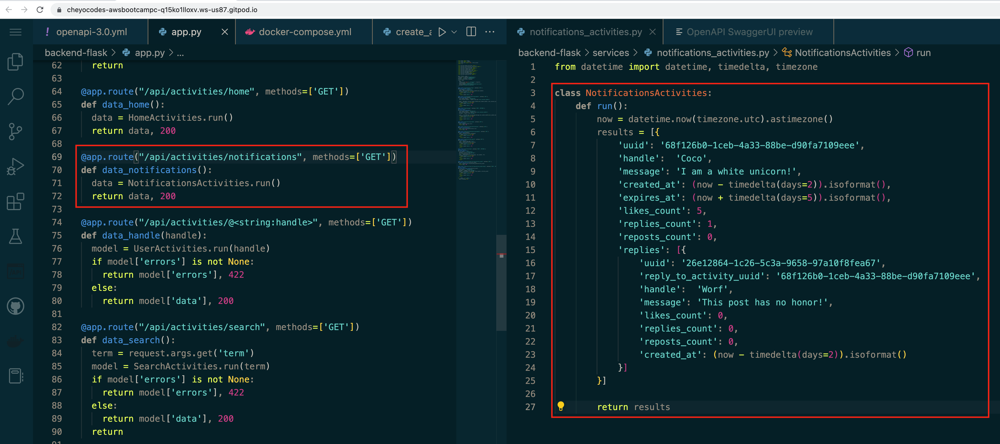

#### Add frontend notifications page 

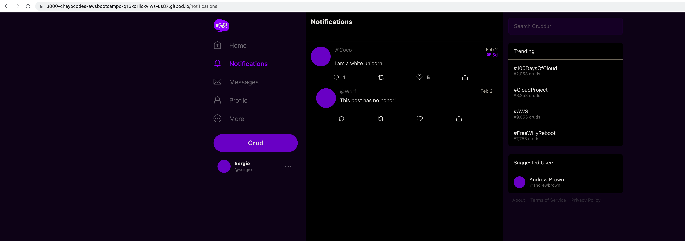

### Install Postgres into Gitpod 

```sh
- name: postgres
  init: |
    curl -fsSL https://www.postgresql.org/media/keys/ACCC4CF8.asc|sudo gpg --dearmor -o /etc/apt/trusted.gpg.d/postgresql.gpg
    echo "deb http://apt.postgresql.org/pub/repos/apt/ `lsb_release -cs`-pgdg main" |sudo tee  /etc/apt/sources.list.d/pgdg.list
    sudo apt update
    sudo apt install -y postgresql-client-13 libpq-dev
```


### Containerizing DynamoDB Local 

```sh
services:
  dynamodb-local:
    # https://stackoverflow.com/questions/67533058/persist-local-dynamodb-data-in-volumes-lack-permission-unable-to-open-databa
    # We needed to add user:root to get this working.
    user: root
    command: "-jar DynamoDBLocal.jar -sharedDb -dbPath ./data"
    image: "amazon/dynamodb-local:latest"
    container_name: dynamodb-local
    ports:
      - "8000:8000"
    volumes:
      - "./docker/dynamodb:/home/dynamodblocal/data"
    working_dir: /home/dynamodblocal
```

### Containerizing PostgreSQL

````sh
services:
  db:
    image: postgres:13-alpine
    restart: always
    environment:
      - POSTGRES_USER=postgres
      - POSTGRES_PASSWORD=password
    ports:
      - '5432:5432'
    volumes: 
      - db:/var/lib/postgresql/data
volumes:
  db:
    driver: local
````

#### Create Dynamodb Local Table (for testing)
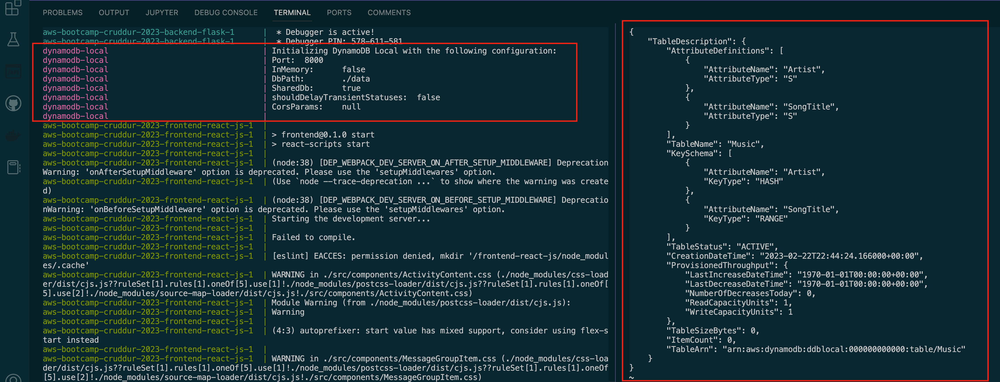


---


## Homework Challenges 
- [ ] Run the dockerfile CMD as an external script
- [ ] Push and tag a image to DockerHub (they have a free tier)
- [ ] Use multi-stage building for a Dockerfile build
- [ ] Implement a healthcheck in the V3 Docker compose file
- [ ] Research best practices of Dockerfiles and attempt to implement it in your Dockerfile
- [ ] Learn how to install Docker on your localmachine and get the same containers running outside of Gitpod / Codespaces
- [ ] Launch an EC2 instance that has docker installed, and pull a container to demonstrate you can run your own docker processes. 


<!--  -->

### Run the dockerfile CMD as an external script


### Push and tag a image to DockerHub (they have a free tier)


### Use multi-stage building for a Dockerfile build


### Implement a healthcheck in the V3 Docker compose file


### Research best practices of Dockerfiles and attempt to implement it in your Dockerfile


### Learn how to install Docker on your localmachine and get the same containers running outside of Gitpod / Codespaces


### Launch an EC2 instance that has docker installed, and pull a container to demonstrate you can run your own docker processes. 


