# Week 2 — Distributed Tracing

## Week 2 Todo Tasks  
- [X] [Watch Week 2 Live-Stream Video](https://www.youtube.com/watch?v=2GD9xCzRId4&list=PLBfufR7vyJJ7k25byhRXJldB5AiwgNnWv&index=30)
- [ ] [Watch Chirag Week 2 - Spending Considerations (Coming Soon)]()
- [ ] [Watched Ashish's Week 2 - Observability Security Considerations](https://www.youtube.com/watch?v=bOf4ITxAcXc&list=PLBfufR7vyJJ7k25byhRXJldB5AiwgNnWv&index=31)
- [X] [Instrument Honeycomb with OTEL](https://www.youtube.com/watch?v=2GD9xCzRId4&list=PLBfufR7vyJJ7k25byhRXJldB5AiwgNnWv&index=30)
- [X] [Instrument AWS X-Ray](https://www.youtube.com/watch?v=n2DTsuBrD_A&list=PLBfufR7vyJJ7k25byhRXJldB5AiwgNnWv&index=32)
- [X] [Configure custom logger to send to CloudWatch Logs](https://www.youtube.com/watch?v=ipdFizZjOF4&list=PLBfufR7vyJJ7k25byhRXJldB5AiwgNnWv&index=33)
- [ ] [Integrate Rollbar and capture and error](https://www.youtube.com/watch?v=xMBDAb5SEU4&list=PLBfufR7vyJJ7k25byhRXJldB5AiwgNnWv&index=35)
q

## Technical Tasks 
Honeycomb.io
- [X] Instrument our backend flask application to use Open Telemetry (OTEL) with Honeycomb.io as the provider
- [X] Run queries to explore traces within Honeycomb.io

AWS X-Ray
- [X] Instrument AWS X-Ray into backend flask application
- [X] Configure and provision X-Ray daemon within docker-compose and send data back to X-Ray API
- [X] Observe X-Ray traces within the AWS Console

Rollbar
- [ ] Integrate Rollbar for Error Logging
- [ ] Trigger an error an observe an error with Rollbar

WatchTower
- [X] Install WatchTower and write a custom logger to send application log data to CloudWatch Log group


### Honeycomb.io
#### Instrument our backend flask application to use Open Telemetry (OTEL) with Honeycomb.io as the provider

Add python dependencies into our `requirements.txt` file and install them
```
flask 
flask-cors

opentelemetry-api 
opentelemetry-sdk 
opentelemetry-exporter-otlp-proto-http
opentelemetry-instrumentation-flask 
opentelemetry-instrumentation-requests
```

Install Dependencies 
```sh
pip3 install -r requirements.txt
```

Set up environment `OTEL_` (OpenTelemetry) variables in our `docker-compose.yml` file 
```sh
version: "3.8"
services:
  backend-flask:
    environment:
      FRONTEND_URL: "https://3000-${GITPOD_WORKSPACE_ID}.${GITPOD_WORKSPACE_CLUSTER_HOST}"
      BACKEND_URL: "https://4567-${GITPOD_WORKSPACE_ID}.${GITPOD_WORKSPACE_CLUSTER_HOST}"
      # OpenTelemetry environment variables 
      # This is what determines the service name in the spans that get sent to your application. 
      OTEL_SERVICE_NAME: "backend-flask"       
      # this is the honeycomb endpoint used to send data
      OTEL_EXPORTER_OTLP_ENDPOINT: "https://api.honeycomb.io"
      # this variable is used to set additional headers in the OTLP requests sent by the exporter. 
      # This can be useful in cases where the backend system requires additional authentication, 
      # authorization or metadata information to be sent in the headers.
      OTEL_EXPORTER_OTLP_HEADERS: "x-honeycomb-team=${HONEYCOMB_API_KEY}" 
...
```

Add instrumentation code to our backend 
```python
# Honeycomb.io
from opentelemetry import trace
from opentelemetry.instrumentation.flask import FlaskInstrumentor
from opentelemetry.instrumentation.requests import RequestsInstrumentor
from opentelemetry.exporter.otlp.proto.http.trace_exporter import OTLPSpanExporter
from opentelemetry.sdk.trace import TracerProvider
from opentelemetry.sdk.trace.export import BatchSpanProcessor
from opentelemetry.sdk.trace.export import ConsoleSpanExporter, SimpleSpanProcessor

# Honeycomb.io 
# Initialize tracing and an exporter that can send data to Honeycomb
provider = TracerProvider()
processor = BatchSpanProcessor(OTLPSpanExporter())
provider.add_span_processor(processor)

# Show this in the logs within the backend-flask app (STDOUT)
simple_processor = SimpleSpanProcessor(ConsoleSpanExporter())
provider.add_span_processor(simple_processor)

trace.set_tracer_provider(provider)
tracer = trace.get_tracer(__name__)

app = Flask(__name__)

# Honeycomb.io 
# Initialize automatic instrumentation with Flask
FlaskInstrumentor().instrument_app(app)
RequestsInstrumentor().instrument()
```

Create Honeycomb environment
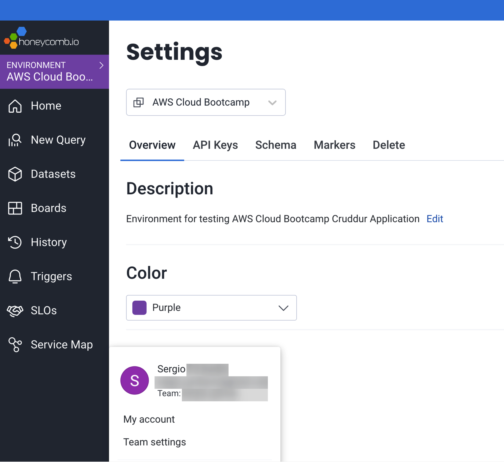

Create span exporter to log on STDOUT
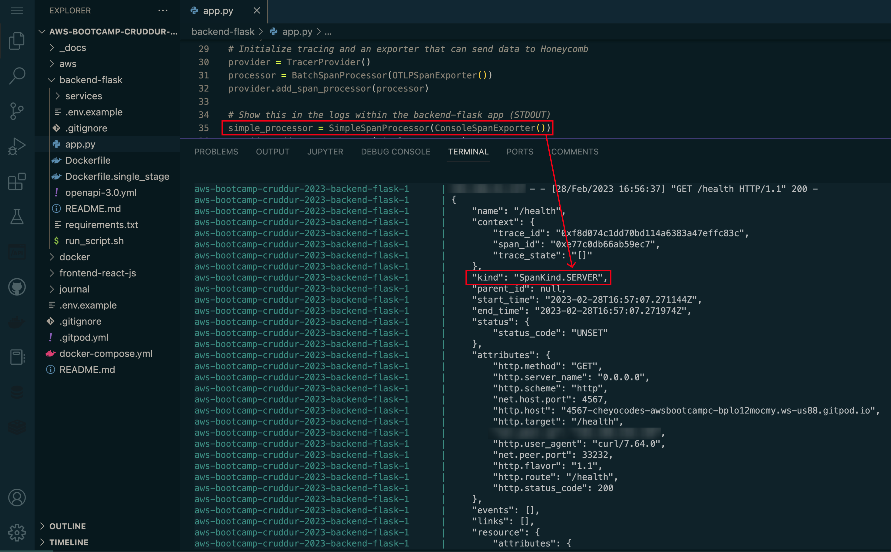


#### Run queries to explore traces within Honeycomb.io
Query new data and show on Honeycomb dashboard
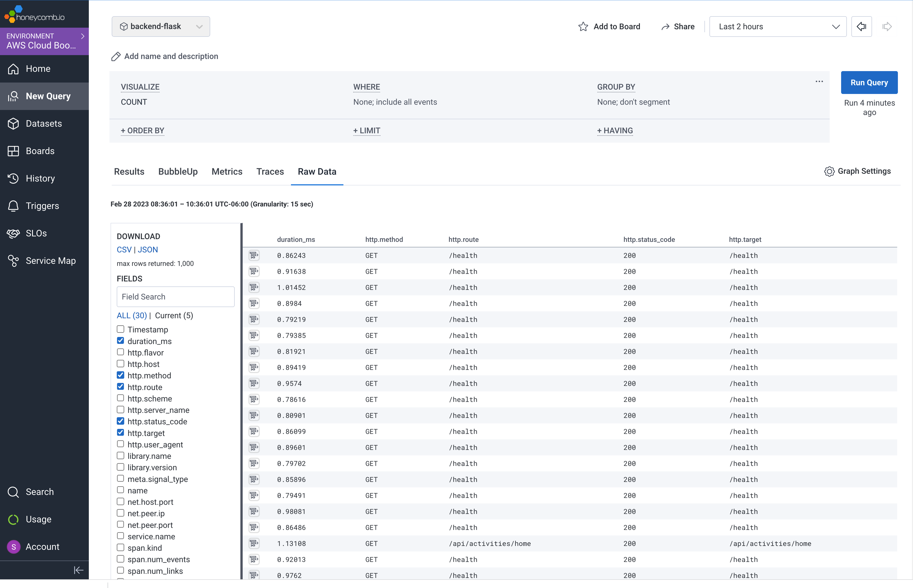

#### Creating a tracer for a module manually
[Acquiring a Tracer](https://docs.honeycomb.io/getting-data-in/opentelemetry/python/#acquiring-a-tracer)

```python
Adding a tracer to the `home_activities.py` file
from opentelemetry import trace    # <------ add this

# the trace is usually named after the module or the file name
# since the file is `home_activities.py` we named the trace `home_activities`
# alternatively we can name it "home.activities
tracer = trace.get_tracer("home.activities") # <------ add this


class HomeActivities:
  def run():
    with tracer.start_as_current_span("home-activities-mock-data"):
      # do something
      span = trace.get_current_span() # gets a reference to the current span it's in 
      now = datetime.now(timezone.utc).astimezone()

      span.set_attribute("app.now", now.isoformat())


      results = [{
        'uuid': '68f126b0-1ceb-4a33-88be-d90fa7109eee',
        'handle':  'Andrew Brown',
        'message': 'Cloud is very fun!',
        'created_at': (now - timedelta(days=2)).isoformat(),
        'expires_at': (now + timedelta(days=5)).isoformat(),
        'likes_count': 5,
        'replies_count': 1,
        'reposts_count': 0,
        'replies': [{
          'uuid': '26e12864-1c26-5c3a-9658-97a10f8fea67',
          'reply_to_activity_uuid': '68f126b0-1ceb-4a33-88be-d90fa7109eee',
          'handle':  'Worf',
          'message': 'This post has no honor!',
          'likes_count': 0,
          'replies_count': 0,
          'reposts_count': 0,
          'created_at': (now - timedelta(days=2)).isoformat()
        }],
      },
      {
        'uuid': '66e12864-8c26-4c3a-9658-95a10f8fea67',
        'handle':  'Worf',
        'message': 'I am out of prune juice',
        'created_at': (now - timedelta(days=7)).isoformat(),
        'expires_at': (now + timedelta(days=9)).isoformat(),
        'likes': 0,
        'replies': []
      },
      {
        'uuid': '248959df-3079-4947-b847-9e0892d1bab4',
        'handle':  'Garek',
        'message': 'My dear doctor, I am just simple tailor',
        'created_at': (now - timedelta(hours=1)).isoformat(),
        'expires_at': (now + timedelta(hours=12)).isoformat(),
        'likes': 0,
        'replies': []
      }]

      span.set_attribute("app.result_length", len(results))
      return results
```

Finding `app.run` and `app.results_length` span attributes in Honeycomb dashboard
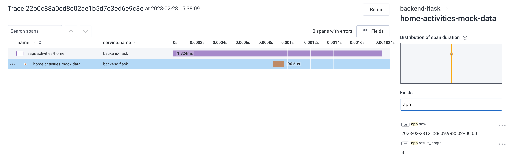


### AWS X-Ray 
#### Instrument AWS X-Ray into backend flask application

##### [Adding X-Ray Middleware to the application](https://docs.aws.amazon.com/xray/latest/devguide/xray-sdk-python-middleware.html)
```python
from aws_xray_sdk.core import xray_recorder
from aws_xray_sdk.ext.flask.middleware import XRayMiddleware

app = Flask(__name__)

xray_url = os.getenv("AWS_XRAY_URL")
xray_recorder.configure(service='Cruddur', dynamic_naming=xray_url)
XRayMiddleware(app, xray_recorder)
```

##### Create `aws/json/x-ray.json` file 
```json
{
    "SamplingRule": {
        "RuleName": "Cruddur",
        "ResourceARN": "*",
        "Priority": 9000,
        "FixedRate": 0.1,
        "ReservoirSize": 5,
        "ServiceName": "backend-flask",
        "ServiceType": "*",
        "Host": "*",
        "HTTPMethod": "*",
        "URLPath": "*",
        "Version": 1
    }
  }
```

##### Create an X-Ray Group
Groups are collections of traces that are defined by a filter expression. Use groups to filter service maps, traces, or analytics. By default, you can create up to 25 groups in addition to the default group. To add more, request an increase with AWS Support.

```sh
aws xray create-group \
   --group-name "Cruddur" \
   --filter-expression "service(\"backend-flask\")"
```

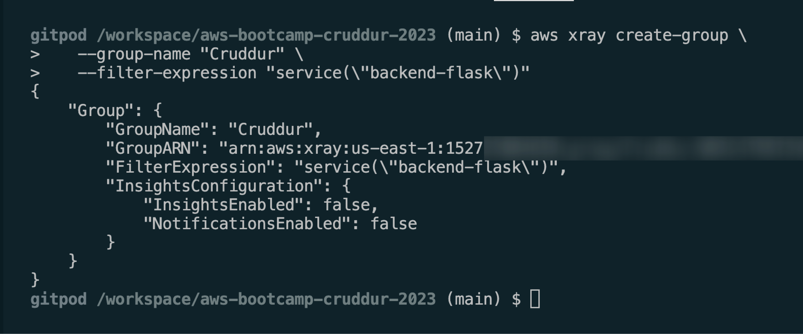

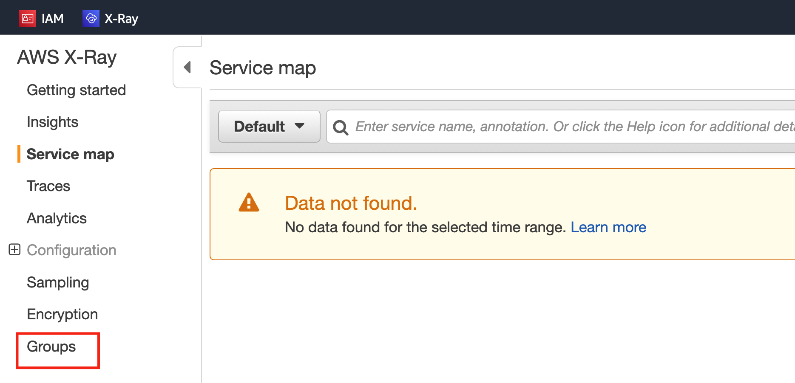

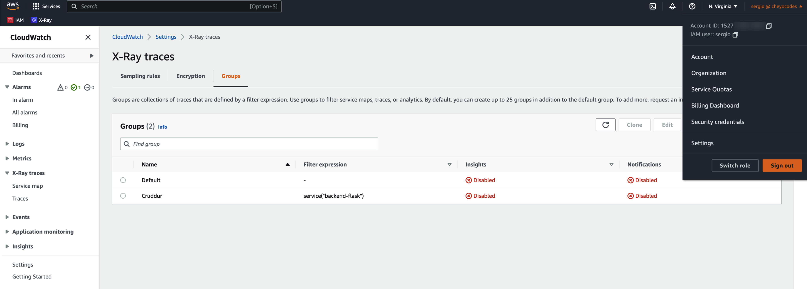


##### Create Sampling Rule 
```sh
aws xray create-sampling-rule --cli-input-json file://aws/json/xray.json
```

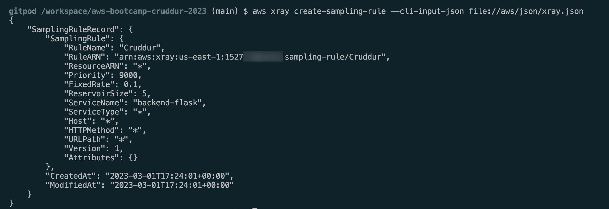

Sampling AWS console view
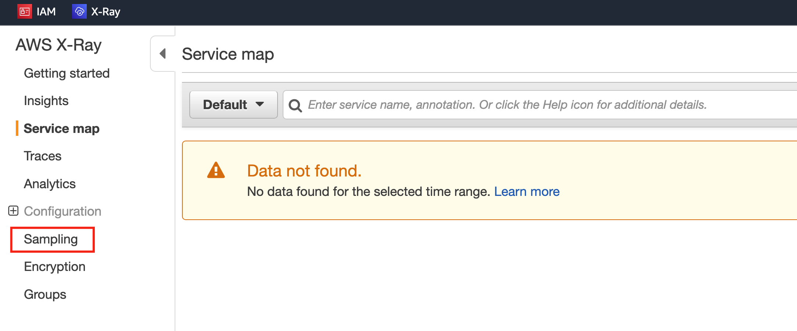
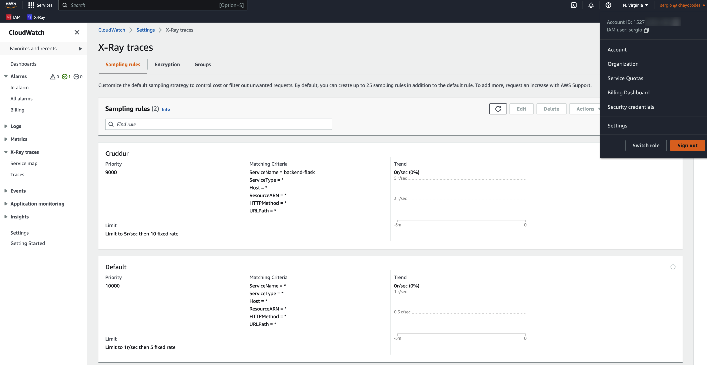


#### Configure and provision X-Ray daemon within docker-compose and send data back to X-Ray API

##### Add AWS X-Ray environment variables to `backend-flask` service 
```sh
# docker-compose.yml
version: "3.8"
services:
  backend-flask:
    environment:
      ...
      # AWS X-Ray
      AWS_XRAY_URL: "*4567-${GITPOD_WORKSPACE_ID}.${GITPOD_WORKSPACE_CLUSTER_HOST}*"
      AWS_XRAY_DAEMON_ADDRESS: "xray-daemon:2000"
```

##### Add AWS X-Ray Daemon to `docker-compose.yml`
```sh
version: "3.8"
services: 
  ...
  xray-daemon:
    image: "amazon/aws-xray-daemon"
    environment:
      AWS_ACCESS_KEY_ID: "${AWS_ACCESS_KEY_ID}"
      AWS_SECRET_ACCESS_KEY: "${AWS_SECRET_ACCESS_KEY}"
      AWS_REGION: "us-east-1"
    command:
      - "xray -o -b xray-daemon:2000"
    ports:
      - 2000:2000/udp
```


#### Observe X-Ray traces within the AWS Console

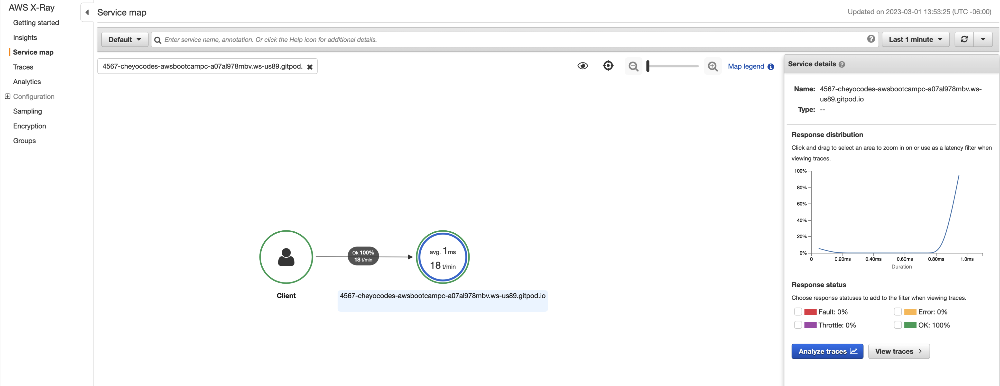

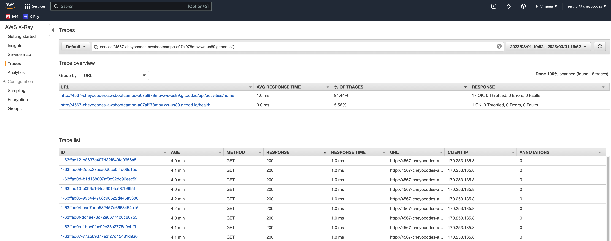

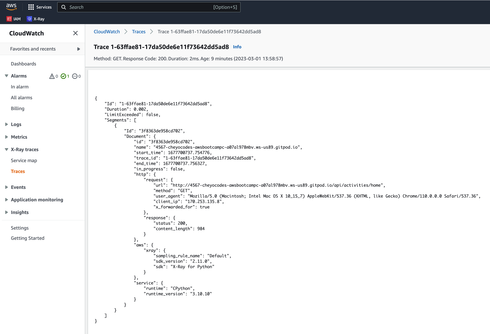


### WatchTower
#### Install WatchTower and write a custom logger to send application log data to CloudWatch Log group

Add `watchtower` package to `requirements.txt` 
```sh
# requirements.txt
...
watchtower 
```

Add dependencies to `app.py` 
```python
import watchtower 
import logging 
from time import strftime
```

Add watchtower instrumentation
```python
# CloudWatch 
# Configuring Logger to Use CloudWatch
LOGGER = logging.getLogger(__name__)
LOGGER.setLevel(logging.DEBUG)
console_handler = logging.StreamHandler()
cw_handler = watchtower.CloudWatchLogHandler(log_group='cruddur')
LOGGER.addHandler(console_handler)
LOGGER.addHandler(cw_handler)
LOGGER.info("HomeActivities")
LOGGER.info("test Log")


app = Flask(__name__)
```

Add logger to `home_activities.py`
```python 
import logging

tracer = trace.get_tracer("home.activities")

class HomeActivities:
  def run():
    LOGGER.info("HomeActivities")
    ...
```

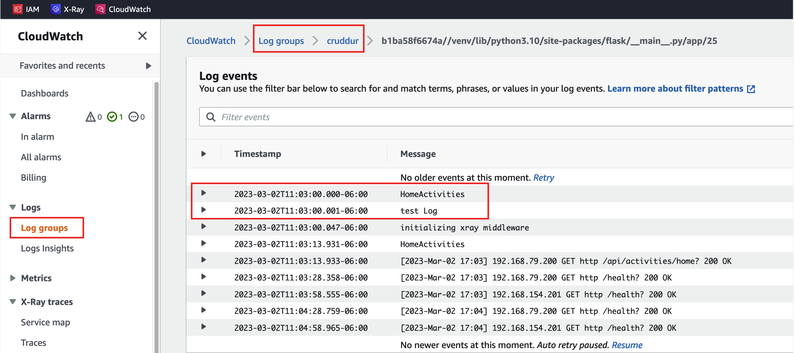


---

#### Homework Challenges
- [ ] Instrument Honeycomb for the frontend-application to observe network latency between frontend and backend [HARD]
- [ ] Add custom instrumentation to Honeycomb to add more attributes eg. `UserId`, Add a `custom span`
- [ ] Run custom queries in Honeycomb and save them later eg. Latency by `UserID`, Add `Recent Traces`

### Instrument Honeycomb for the frontend-application to observe network latency between frontend and backend [HARD]
### Add custom instrumentation to Honeycomb to add more attributes eg. `UserId`, Add a `custom span`
### Run custom queries in Honeycomb and save them later eg. Latency by `UserID`, Add `Recent Traces`